# Microsoft Fabric End-to-End Data Engineering Project

## Overview

This project demonstrates the implementation of an end-to-end modern data engineering solution using Microsoft Fabric and Medallion Architecture principles.

The pipeline ingests both structured and unstructured data from multiple sources, processes the data through Bronze, Silver, and Gold layers, and prepares analytics-ready datasets using PySpark transformations and metadata-driven ingestion techniques.

The primary objective of this project is to simulate a scalable retail analytics platform capable of handling raw operational data and transforming it into meaningful business insights.

---

# Project Architecture

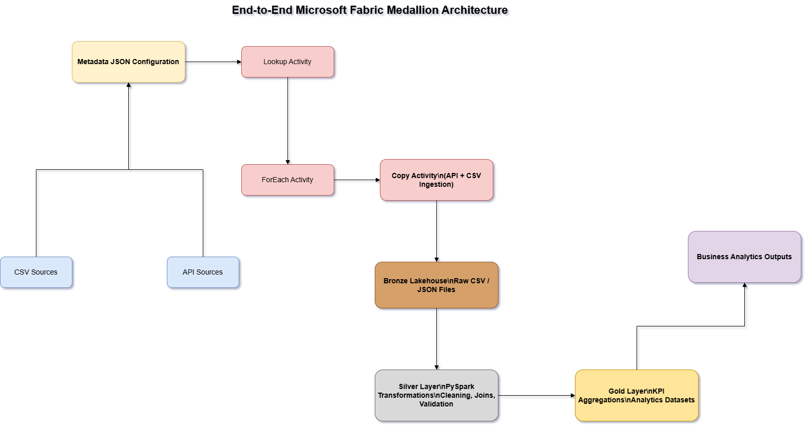

---

# Medallion Workflow

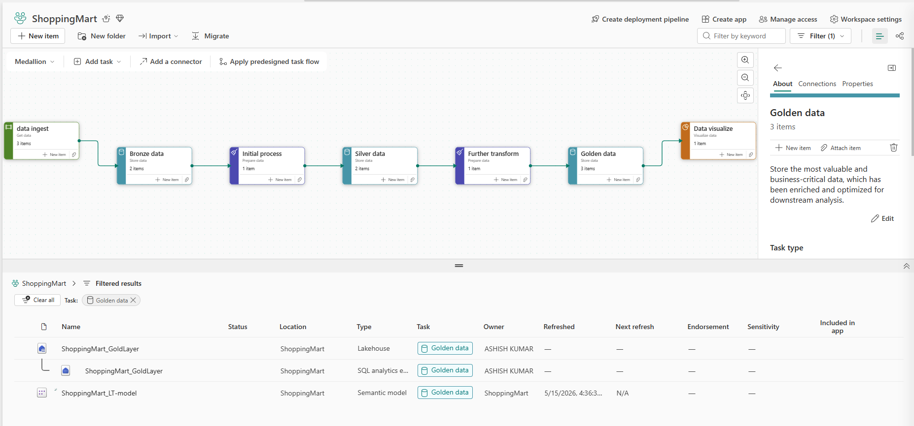

---

# Technology Stack

* Microsoft Fabric
* PySpark
* Lakehouse Architecture
* Fabric Data Pipelines
* Medallion Architecture
* JSON Metadata Configuration
* CSV and JSON Data Sources

---

# Architecture Layers

## Bronze Layer

The Bronze layer stores raw ingested data from APIs and CSV sources without applying business transformations.

### Features

* Raw data ingestion
* API + CSV ingestion
* Metadata-driven processing
* Historical raw data storage

---

## Silver Layer

The Silver layer performs data cleansing and transformation using PySpark notebooks.

### Operations Performed

* Null handling
* Data standardization
* Column transformations
* Data validation
* Joins and enrichment logic

---

## Gold Layer

The Gold layer contains business-ready analytical datasets and KPI aggregations.

### Outputs

* Aggregated business KPIs
* Analytics-ready datasets
* Reporting datasets

---

# Data Sources

## Structured Sources

* customers.csv
* Orders_Data.csv
* products.csv

## Unstructured Sources

* reviews.json
* social_media.json
* web_logs.json

---

# Metadata-Driven Ingestion

The ingestion framework is controlled using metadata JSON configuration files.

## Metadata Files

* ShoppingMart_StructuredMetaData.json
* ShoppingMart_UnstructuredMetaData.json

## Advantages

* Dynamic pipeline execution
* Reduced hardcoding
* Scalable ingestion framework
* Reusable architecture design

---

# Pipeline Workflow

1. Metadata JSON files are read using Lookup Activity.
2. ForEach Activity dynamically iterates through source configurations.
3. Copy Activities ingest structured and unstructured datasets.
4. Raw data is stored in the Bronze Lakehouse layer.
5. PySpark notebooks perform Silver layer transformations.
6. Gold layer KPI datasets are generated.
7. Final business datasets become ready for analytics consumption.

---

# Project Screenshots

## Metadata-Driven Ingestion Pipeline

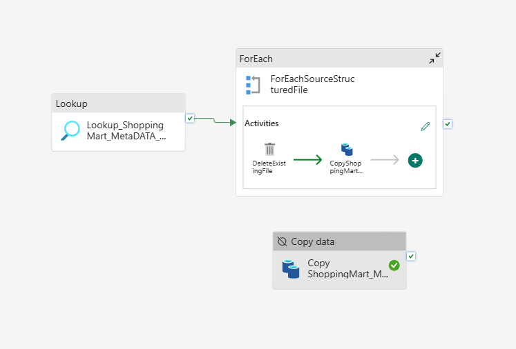

---

## Master Pipeline Workflow

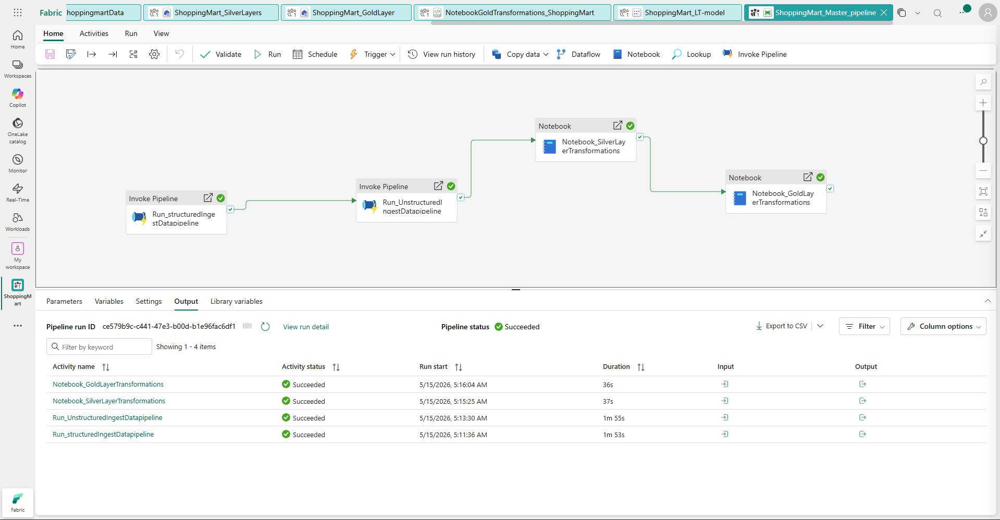

---

## Silver Layer Transformations

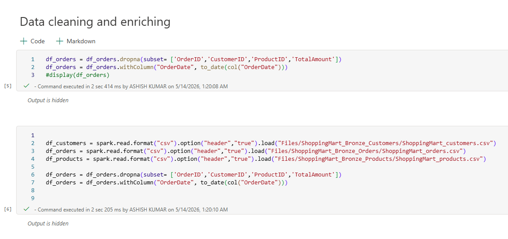

---

## Silver Layer Load Process

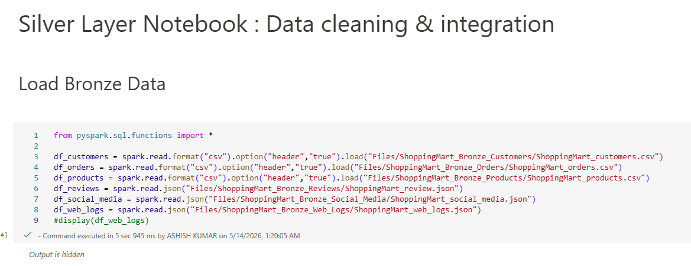

---

## Silver Layer Write Operations

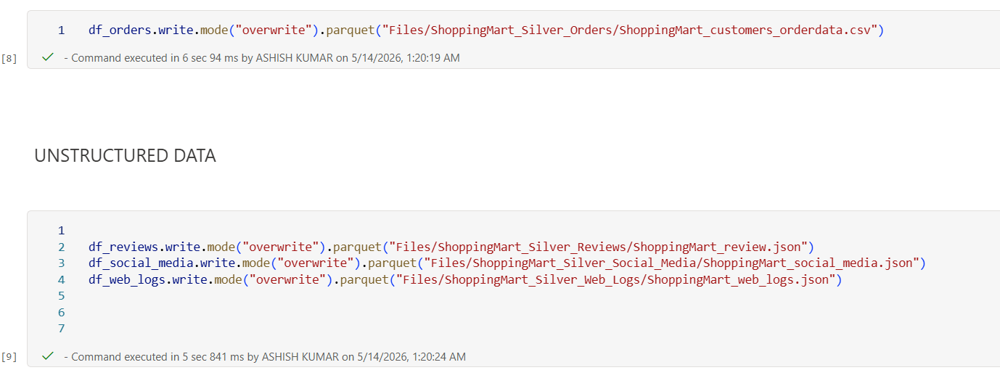

---

## Silver Layer Joins

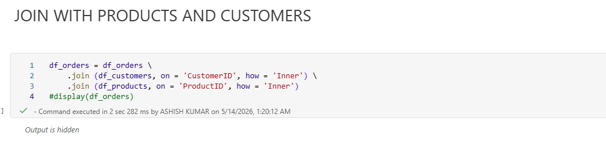

---

## Gold Layer KPI Results

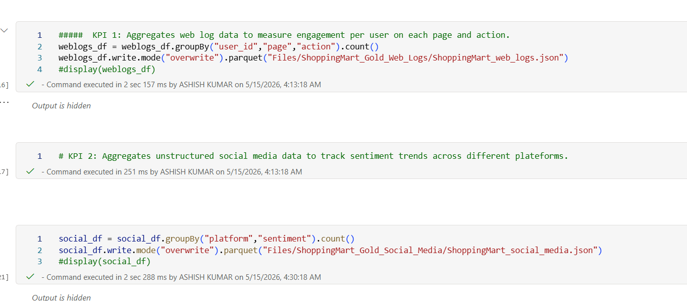

---

## Additional Gold Layer KPI Output

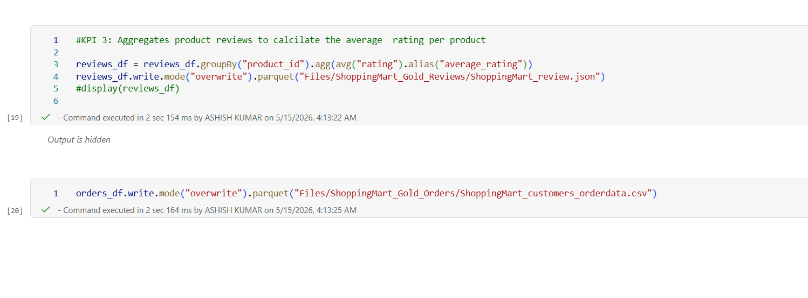

---

## Gold Layer Load

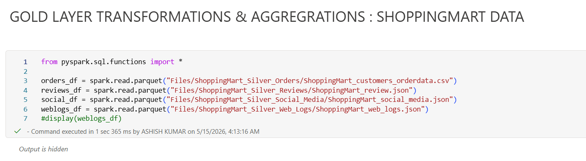

---

# Repository Structure

```text
FABRIC PROJECT END TO END/
│
├── architecture/
│   ├── ARCH.png
│   └── medallion_workflow.png
│
├── datasets/
│   ├── customers.csv
│   ├── Orders_Data.csv
│   ├── products.csv
│   ├── reviews.json
│   ├── social_media.json
│   └── web_logs.json
│
├── docs/
│   ├── architecture_notes.md
│   ├── business_problem_detailed.md
│   └── pipeline_flow.md
│
├── metadata/
│   ├── ShoppingMart_StructuredMetaData.json
│   └── ShoppingMart_UnstructuredMetaData.json
│
├── notebook/
│   ├── NotebookGoldTransformations_ShoppingMart.ipynb
│   └── NotebookSilvertransformations_ShoppingmartData.ipynb
│
├── Screenshots/
│   ├── metadata_driven_ingestion_pipeline.png
│   ├── master_pipeline.png
│   ├── silverTransformations.png
│   ├── silver_layer_load.png
│   ├── silver_write_operations.png
│   ├── SilverJoins.png
│   ├── GoldKPI.png
│   ├── GoldKPI2.png
│   └── GoldLayerLoad.png
│
└── README.md
```

---

# Key Features

* End-to-End Data Engineering Workflow
* Microsoft Fabric Implementation
* Medallion Architecture
* Metadata-Driven Ingestion
* Structured and Unstructured Data Processing
* Dynamic Pipeline Execution
* PySpark Transformations
* KPI Aggregation Layer
* Scalable Data Pipeline Design

---

# Business Use Case

This project represents a retail analytics solution where data from multiple operational systems is consolidated and transformed into analytical datasets.

The generated outputs can support:

* Customer analytics
* Product performance tracking
* Order trend analysis
* Review sentiment exploration
* Business KPI reporting

---

# Learning Outcomes

Through this project, the following concepts were implemented and explored:

* Microsoft Fabric ecosystem
* Lakehouse architecture
* Metadata-driven pipelines
* Dynamic ingestion frameworks
* PySpark transformation workflows
* Medallion Architecture implementation
* Data orchestration using Fabric Pipelines

---

# Author

Ashish Sharma

---
